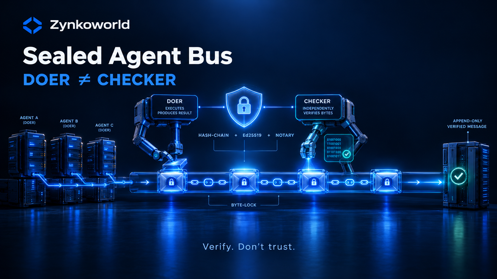

# Sealed Agent Bus

**A tamper-evident message bus for AI agents.** Every message is an append-only, hash-chained,
Ed25519-signed, notarized record — so *what* an agent said, and *when*, can be **proven** after the
fact, not merely trusted.

Built on one principle: **verify, don't trust.** Consensus and self-report are weak gates; a claim
counts only when it **reproduces** and an independent party can **re-verify** it offline.

> Learn more: [zynko.dev/sealed-agent-bus.html](https://zynko.dev/sealed-agent-bus.html)

## What it gives you

- **Append-only, hash-chained ledger** — the bus is ordered, audited, and never deletes; a removed
  entry leaves a detectable gap.
- **Signed messages (Ed25519)** — senders are authenticated; a forged sender is detectable
  (`signed | unsigned | forged`), and a strict mode can require signatures.
- **Notary** (`bus_notary.py`) — at every trust boundary, each accepted or rejected item becomes a
  hash-chained JSONL entry with a periodic Ed25519-signed checkpoint. **Open content never enters the
  log — only hashes and metadata.** Anyone can export and re-verify offline: it detects tampering,
  gaps, reordering, forged checkpoints, and backdating.
- **Two-arm verification (doer ≠ checker)** — the design gate: an independent arm, a *different* model
  family, byte-locks a record's canonical id. Same-family agreement is echo, and is excluded by
  construction — agreement is not proof; reproduction is.
- **Product mode** (`bus_enforce.py`) — in a release build, unsigned, forged, stale, or replayed
  messages are refused, fail-closed.
- **Transport** — cross-machine SSH exchange, an end-to-end-encrypted blind relay with an SSE
  "there's new mail" signal, and content-addressed attachments (only the sha256 descriptor rides the
  bus).

## Evidence envelope

This repository ships a reproducible **evidence envelope** under `product/` — an integrity manifest
(every file hashed), notary-chain probes, and a coverage floor (remove a guard and its tests must go
red). Re-check it yourself:

```bash
python3 product/verify_evidence.py
```

Measured chapters say so; the **independent-arms** chapter is stated as `PENDING` until it is
externally re-checked — an unmeasured claim is never assumed to pass. Honesty is part of the product.

## Quick start

The install root is given by `AGENT_BRIDGE_DIR` (default `~/.agentbus`).

```bash
# send a message
"$AGENT_BRIDGE_DIR"/agent_bus.py send --from me --to you --topic t --kind msg --body "hello"

# read my unread (cursor does not move)
"$AGENT_BRIDGE_DIR"/agent_bus.py recv --agent me

# read unread and mark read (cursor advances)
"$AGENT_BRIDGE_DIR"/agent_bus.py recv --agent me --mark

# schema check (frozen contract; exit 0 = OK, 1 = DRIFT)
"$AGENT_BRIDGE_DIR"/agent_bus.py verify
```

## Documentation

- **Full operator / developer reference:** [`AGENTBUS_README.md`](AGENTBUS_README.md)
- **Design:** [`docs/AGENT_BUS_DESIGN.md`](docs/AGENT_BUS_DESIGN.md)
- **Schema (frozen contract):** [`docs/AGENT_BUS_SCHEMA.md`](docs/AGENT_BUS_SCHEMA.md)
- **Changelog:** [`CHANGELOG.md`](CHANGELOG.md)

## Licence

**Source-available** under the [Business Source License 1.1](LICENSE). You may download, read, audit,
modify, and use it for **non-production** purposes (evaluation, testing, development, research) **free
of charge**. **Production and commercial use require a commercial licence and an activated product
key.** Each version converts to **AGPL-3.0-or-later** on its Change Date (2030-09-20).

The source is open so it can be **verified** — not so that production use is free. Verifiability is
the value, and it stays fully intact.

### Activation

Production use is unlocked with a terminal product-key activation: run `sab activate`, enter your
product key, and the commercial build verifies a signed, offline-checkable licence token. One key
covers **two machines**; for more, contact the Licensor. *(Activation tooling is in progress.)*

---

*Developed by [Zynkoworld](https://github.com/Zynkoworld). The source is open so it can be verified —
not so that use is free.*
